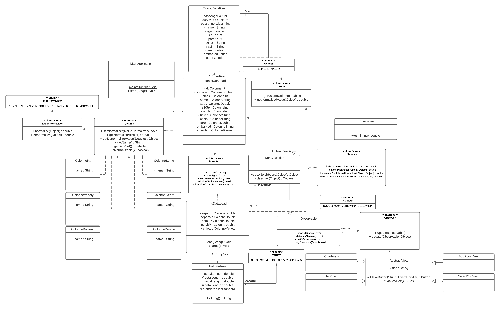

# SAE 3.02 DEV. application: Classification

## Composition de l'équipe
- BEDRICI Léa
- TOP-POTTEZ Charles
- HAYAR Malak
- MARGELY Gwendal 

## Cas d'utilisation

<mark>**FICHE DESCRIPTIVE: Visualiser les données**</mark>

**Système:** Application

**Cas d’utilisation:** Afficher les données/ Visualiser les données

**Garantie en cas de succès:** L’utilisatrice peut visualiser les différents points selon les données sélectionnées 

<mark>Scénario nominal: </mark>
- L’utilisatrice sélectionne “Afficher les données graphiquement”
- Le système affiche une pop-up avec tous les attributs
- L’utilisatrice sélectionne 2 attributs (pas plus, peut-être 1) et valide
- Le système affiche le nuage de points 
- L’utilisatrice sélectionne (ou passe la souris) sur un point
- Le système affiche une popup avec les données du point

<mark>Scénarios alternatif:</mark>
- L’utilisatrice sélectionne “Afficher les données graphiquement” mais aucun point n’est enregistré et aucun csv n’a été importé
- Le système renvoie un message d’erreur (popup) “Veuillez importer un csv ou ajouter un point manuellement” 
- L’utilisatrice sélectionne “Ok”
- Le système renvoie sur  la page de sélection des csv

- A partir de l’étape 4 du scénario nominal, l’utilisatrice ne sélectionne pas d’attribut
- Le système affiche un message d’erreur en rouge “Veuillez sélectionner un ou deux attributs à afficher”
- Étape 5 du scénario nominal.

<mark>**FICHE DESCRIPTIVE: Saisir un point**</mark>

**Système:** Application

**Cas d’utilisation:** Saisie d’un point

**Garantie en cas de succès:** Ajout d’un nouveau point 

<mark>Scénario nominal:</mark>
- L’utilisatrice sélectionne “Ajouter un point”
- Le système ouvre une popup avec un formulaire selon les attributs du csv choisi
- L’utilisatrice rempli le formulaire avec les données du point puis valide
- Le système affiche un récapitulatif des informations saisie et demande validation
- L’utilisatrice confirme son choix
- Le système enregistre.

<mark>Scénarios alternatif:</mark>
- On reprends à l’étape 5
- Le système enregistre et affiche le point si l’utilisatrice est déjà dans la page de visualisation des données 

- On reprends à l’étape 1 mais l’utilisatrice n’a pas choisi de csv
- Le système renvoie un message d’erreur “Veuillez importer un csv ou ajouter un point manuellement” 
- L’utilisatrice sélectionne “Ok”
- Le système renvoie sur la page de sélection des csv

<mark>**FICHE DESCRIPTIVE: Importer un CSV (1)**</mark>

**Système:** Application

**Cas d’utilisation:** Importation des données depuis un CSV pour classifier les données

**Garantie en cas de succès:** un jeu de donnée est importé

<mark>Scénario nominal: </mark>
- L’utilisatrice sélectionne “Importer un CSV” 
- Le système ouvre une popup avec la liste des fichiers CSV qui peuvent être utilisé (dont on a le classifieur)
- L’utilisatrice choisit le jeu de données.
- Le système confirme le chargement des données et classifie les données. 

<mark>**FICHE DESCRIPTIVE: Importer un CSV (2)**</mark>

**Système:** Application

**Cas d’utilisation:** Importer un csv pour le modèle classifieur

**Garantie en cas de succès:** Trouve le classifieur correspondant au fichier

<mark>Scénario nominal: </mark>
- L’utilisatrice importe un csv (scénario du cas d’utilisation “Importer un csv”)
- Le système cherche le classifieur correspondant au fichier choisi et ouvre une pop up indiquant pour chaque attribut sa normalisation, et les classes possibles. 

<mark>**FICHE DESCRIPTIVE: Catégorisation des données**</mark>

** Système: ** Application

** Cas d’utilisation: ** Catégorisation des données

** Garantie en cas de succès: ** Chaque donnée sera associée à un classe

<mark>Scénario nominal: </mark>
- L’utilisatrice sélectionne “Catégoriser les données”.
- Le système affiche une liste des différents jeux de données.
- L’utilisatrice sélectionne le jeu de données qu’elle souhaite et valide en cliquant sur “Lancer la catégorisation”.
- Le système lance l’algorithme de KNN qui associe chaque donnée à une classe puis une couleur à chaque classe.

<mark>Scénario alternatif:</mark>

- On reprend à l’étape 2
- L’utilisatrice ne sélectionne directement “Lancer la catégorisation” sans choisir un jeu de données
- Le système affiche un popup avec écrit “Veuillez d’abord choisir un jeu de données”.
- L’utilisatrice clique sur le bouton “OK” en bas du popup 
- Retour à l’étape 3. 

<mark>**FICHE DESCRIPTIVE: Test de Robustesse**</mark>

**Système:** Application

**Cas d’utilisation:** Test de Robustesse

**Garantie en cas de succès:** Visualiser le pourcentage de réussite

<mark>Scénario nominal: </mark>
- L'utilisatrice sélectionne "Test de Robustesse"
- Le système affiche une page où l'utilisatrice peut importer de nouvelles données ou choisir la cross-validation 
- L'utilisatrice choisit sa méthode (importe un csv pour les nouvelles données) et valide
- Le système lance le test et renvoie le taux de robustesse 

<mark>Scénarios alternatif:</mark>
- On reprend à l'étape 2
- L'utilisatrice importe des données non exploitables.
- Le système renvoie un pop up d'erreur "Donnée non exploitables"
- L'utilisatrice clique sur "OK" 
- Le système renvoie à la page de choix de données
- L'utilisatrice sélectionne d'autres données.

<mark>**FICHE DESCRIPTIVE: Choisir les attributs à afficher**</mark>

**Système:** Application

**Cas d’utilisation:** Choisir les attributs à afficher*

**Precondition:** avoir affiché les données une première fois

**Garantie en cas de succès:** Change l'axe des abscisses/ordonnées dans la visualisation

<mark>Scénario nominal: </mark>
- L'utilisatrice sélectionne "Changer les attributs"
- Le système affiche un formulaire avec un choix d'attribut pour x et pour y (déjà rempli avec les attributs affichés à ce moment)
- L'utilisatrice choisit un nouveau x/un nouveau y et valide
- Le système affiche à nouveau le nuage de points selon les attributs choisis

## Différence entre les UML

- **Premier UML:**

- **Deuxieme UML:**

- **Les changements :**

	- <mark>TitanicLoad</mark> et <mark>IrisLoad</mark> n'existent plus.
	- Désormais, on utilise <mark>Dataset</mark>, une classe générique qui prends tout point tant que sa classe <mark>RawData</mark> est définie.
	- <mark>Column</mark> est désormais générique, elle n'existe plus sous la forme ColumnInt, ColumnString, etc. 
	- Ce qui change pour <mark>Column</mark> est simplement son normaliseur.
	- On a 4 classes <mark>Normalizer</mark> pour chaque type de normalisation possible. (*boolean*, *enum*, *number* et *pas de normalisation possible*) 
	- L'enum <mark>TypeNormalizer</mark> n'existe plus.
	- <mark>Classifier</mark> a les méthodes *closeNeighbours*, *classify* et *robustness*.
 	-  	**Pour les interfaces:**
	    - <mark> IDistance</mark> est implémentée par deux classes <mark>EuclidianDistance</mark> et <mark>ManhattanDistance</mark>.
	    - <mark> IPoint </mark> est toujours implémenté par <mark>Iris et TitanicRawData</mark>.
	    - <mark> IColumn </mark> est implémentée par la classe <mark>Column</mark>.
	    - <mark> IValueNormalizer </mark> est implémenté par les différents normaliseurs.
	    - <mark> IDataSet </mark> est implémentée par la classe <mark>DataSet</mark>.
	- Dans <mark>TitanicRawData</mark>, embarked n'est plus un char mais une enum contenant *S*, *Q*, *C* et *null*. 
	- Dans <mark>Gender</mark>, la valeur *OTHER* est spécifiée si l'espace est laissé vide. (*pas besoin de NullObject dans IrisVariety puisqu'il a un NullNormalizer*)
	- **Pour le MVC:** 
		 - On a une classe <mark>Modele</mark> qui pèche les éléments des classes du backend qui servent à l'interface, elle hérite de <mark>Subject</mark>. 
		 - On a plusieurs vues, dont <mark>MainView</mark>, la page principale qui implémente <mark>Observer</mark>.
		 - Les autres vues sont des pop-up qui n'observent pas <mark>Modele</mark> mais qui peuvent <mark>changer ses attributs</mark> via leurs controlleurs. 
		 - On a la classe <mark>Main</mark> qui lance la <mark>MainView</mark> qui elle-même lance les autres vues.

## Les problèmes encontrés

- **La compréhension du projet:** 
	- Il était vraiment difficile d'avoir une bonne vision du projet au tout début. Surtout avec les <mark>interfaces</mark> données.
	- On peut voir à la différence entre les deux <mark>UML</mark> qu'avec le temps on a commencé à beaucoup mieux comprendre les enjeux et <mark>l'implémentation des fonctionnalités</mark> demandées. 
	- C'est là le <mark>paradoxe de la gestion projet</mark>, plus le projet avance, mieux on comprend, mais moins de temps il nous reste. 
	- Au final, les classes ont été <mark>changées</mark> à multiple reprises et la construction de nos packages aussi. Une fois qu'on avait la bonne structure en tête, tout est devenu beaucoup plus fluide. 
- **La répartition des tâches:**
	- On a tous des sujets où on est plus confortables. 
	- *Malak* et *Léa* se sont surtout occupées du <mark>backend</mark> aidées par *Charles*. 
	- *Gwendal* s'est occupé du <mark>style de l'interface</mark> et de son implémentation dans le code. 
	- *Charles* s'est occupé du <mark>MVC</mark> aidé par *Léa*. 
- **La généricité des classes:** 
	- L'idée de <mark>classes génériques</mark> permettant de classifier des iris comme des passagers a été difficile à comprendre dans sa profondeur. 
	- On réussi à comprendre le concept presque 1 mois après le début de la Saé. 
- **L'interface graphique:**
	- Le <mark>MVC</mark> n'est pas un patron simple à implémenter, surtout quand il s'agit d'un projet et d'une interface aussi conséquente que celle-ci. 
	- On a fait beaucoup de <mark>*pair-programming*</mark> pour pallier aux points faibles de chacun, surtout quand il s'agit du <mark>JavaFX</mark> et <mark>FXML</mark>. 
	- <mark>ScatterChart</mark> est un outil qu'on avait jamais utilisé avant. Heureusement, une bonne lecture de la doc nous a permis de l'utiliser. 
	- Avec la <mark>MainView</mark> qui est une page qui a énormément de fonctionnalités, on se retrouve très vite avec une classe de plus de 400 lignes. 

